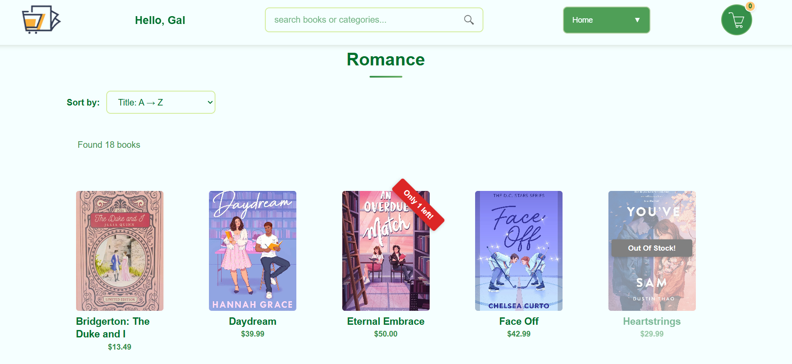
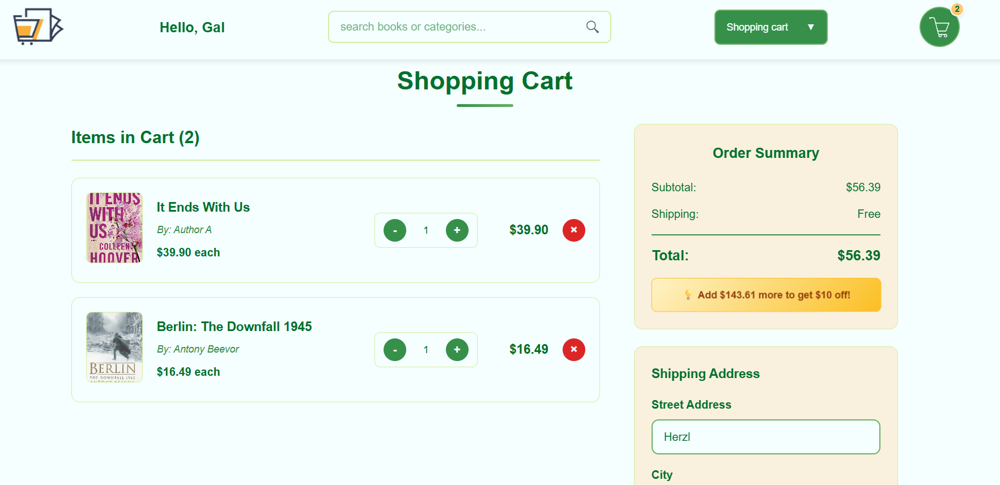
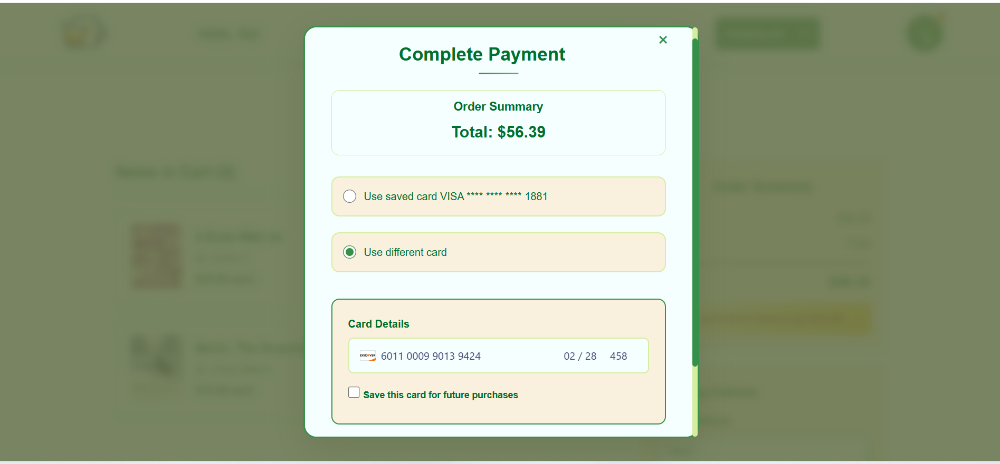
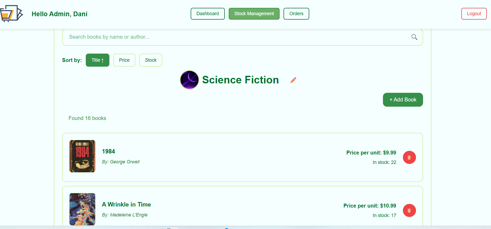
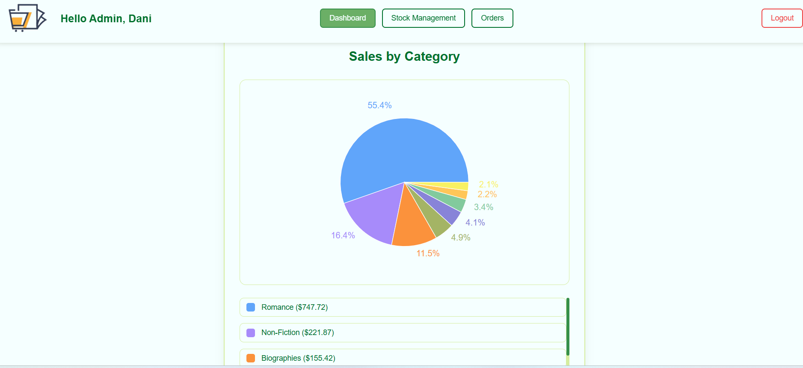

# Full-Stack Online Bookstore Web Application

An end-to-end full-stack web application for an online bookstore, developed using React, Node.js, Express, and MySQL.  
The system is based on a client-server architecture and includes business logic, RESTful APIs, role-based access control, and Stripe payment integration.

## Features

### User Management
- User authentication and authorization
- Role-based access: Customer and Admin

### Customer Features
- Browse and search books
- Shopping cart management
- Place orders
- View order history
- Payment processing via Stripe

### Admin Features
- Inventory management (add, update, remove books)
- Order tracking
- View sales statistics and order data

## Technologies Used

### Frontend
- React
- JavaScript (ES6)
- HTML5, CSS3

### Backend
- Node.js
- Express
- REST APIs
- Integration with external services (Stripe)
- Business logic implementation

### Database
- MySQL

### Architecture
- Client-server architecture
- Modular and reusable code structure

## Purpose

This project was developed as part of Computer Science studies, in collaboration with a partner, to gain hands-on experience in full-stack web development, including frontend and backend integration, database design, and real-world business logic.

## Screenshots

### Customer View – Browse & Shopping Cart

*Browse books, add to cart, and manage orders.*

### Customer View – Payment

*Place orders and complete payment using Stripe.*

### Admin View – Inventory & Orders

*Manage inventory, track orders, and view statistics.*

### Optional: Admin View – Sales Statistics

*Visualize sales and order data.*

